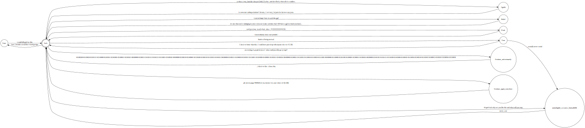

# CARD
    
---

## Definition:
  
Let **C** be a collection of particles, neuroses, obscure samurai lore, and math books.  
Consider a universe **U** which not only allows trash confluence object Graham to exist
but rewards him for his expensive hobby of drawing graphs.  
It is immediately clear this universe has the godless property, signified by **N** for no god.  
Finally, we take the highest alphabetical grade achieved in GRAT, which is **T**, and we have  
`CUNT`.  Applying a cryptographic transformation yields  
`CUNT mod 69 === JACK`.  
Then the entity known as JACK has been defined.  

## Theorem: JACK is 24 years old
    
## Proof:
    
We define JACK as a category `Cat(J)`, whose objects are the pages of the many books he reads.  
The morphisms between them are described as below:    

---

The algebra of the Octonions **O** is a vector space of dimension 8 over **R**.  
Moreover, `8 * 3 = 24`    

Let f be a morphism between JACK and **O**.  
**O** is also the fifteenth letter of the alphabet.    

We look to JACK's formative years; a deep dive into his previous social media **|S|**  
( **|S|** = `{ friend | !real(friend) && posts_shite(friend) }` )  
reveals JACK was only capable of understanding life through Minecraft constructions.    

We must then construct a finite state automaton to accept the language encoded into his psyche, given below:  
The automaton of scholarly states (or ASS for short):  

 automaton of scholarly states 

  
<! --  ->

  
The implications are immediately obvious.  

 click me ?? 

` press to simplify `    

In fact, this automaton not only accepts JACK's current literary intake but also all future reading he will ever do.  
As such, JACK's entire academic career has been encoded into this ASS.  
We have included an [example excerpt here](beemoviefrench.md).  

