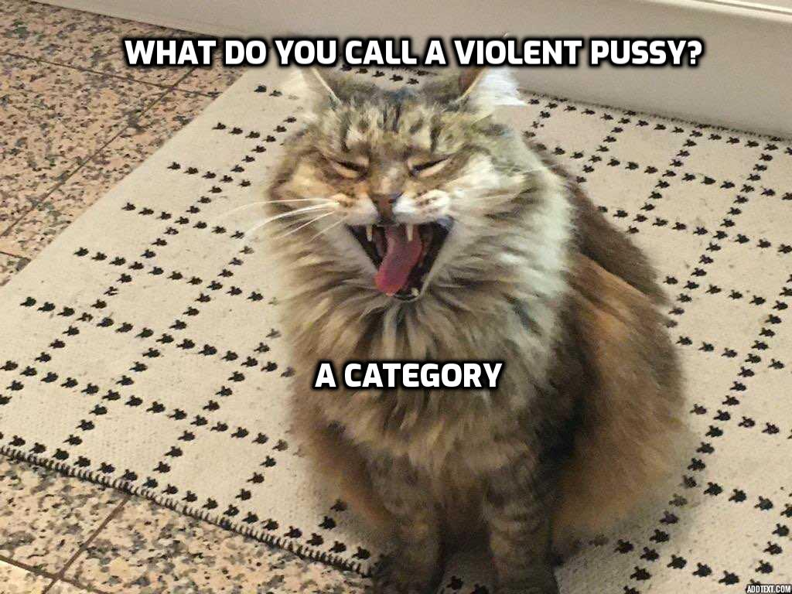
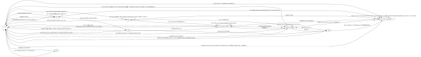
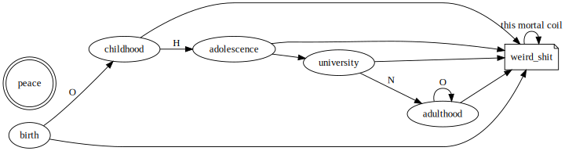

# CARD
    
---
  
## Abstract

It is self-evident that, given a space of sufficient dimension
such that there exists both a library and fatfucking facilities,  
there will necessarily exist a [[cryptid]] living in these facilities,
shunning sunlight, and subsisting off algebraic texts [1].
  

In this paper, we prove the existence of such a creature and define it as a category,  
using the [Fåt-Bastærde functor](https://www.fatbastard.com/product/chardonnay/) to map it to a representation  
of the cosmic unfairness of a world that would not only allow but necessitate such a wretched creature exist at all.  
  

Surprising results about the nature of the beast will be explored,  
finishing off with wise words from a former acquaintance, and suggestions for how to forcibly terminate this fuck.
      
Special thanks to the Graph Transformation Department at the University of York [3] and the LaTeX Division  
of the now-defunct Leeds office of Imagination Technologies for funding and empowering this research,  
in return requesting only that no one involved ever return to either city.  
    
## Methodology
We analysed trends in local cheese consumption, records of eldritch algebaraic texts disappearing,  
and rumours of dark fantasy explorations and potential discordian rites being performed late into the night.  
All
No animals were harmed in the course of this study, 
though all colleagues involved in peer-review reported receiving 2d4 psychic damage.  
    
## Background: Category Theory

First, a primer on basic concepts in category theory.
    

    
Now you have a master's in category theory.  

## Definition: JACK

Definition

  
Under the standard model, we consider four fundamental interactions between matter:  

Let **C** be a collection of particles, neuroses, obscure samurai lore, and math books.  
Consider a universe **U** which not only allows trash confluence object Graham [2] to exist
but rewards him for his expensive hobby of drawing graphs.  
It is immediately clear this universe has the godless property, signified by **N** for no god.  
Finally, we take the highest alphabetical grade achieved in GRAT, which is **T**, and we have  
`CUNT`.  Applying a cryptographic transformation yields  
`CUNT mod 69 === JACK`.  
Then the entity known as JACK has been defined.  

    

## Some surprising results

## Theorem: JACK is 24 years old
    
## Proof:
    
We define JACK as a category `Cat(J)`, whose objects are the pages of the many books he reads.  
The functors between them are described as below:    

---

The algebra of the Octonions **O** is a vector space of dimension 8 over **R**.  
Moreover, `8 * 3 = 24`    

Let F be a functor between JACK and **O**.  
**O** is also the fifteenth letter of the alphabet, so we look to JACK's formative years.  

Following a deep dive into his previous social media **|S|**  
( **|S|** being a category containing Club Penguin and a 
reveals JACK was only capable of understanding life through Minecraft constructions.    

We must then construct a finite state automaton to accept the language encoded into his psyche, given below:  
The automaton of scholarly states (or ASS for short):  

 automaton of scholarly states 

  
<!--  -->

  
The implications are immediately obvious.  
A reduced graph resulting from row echelon reduction has nevertheless been included for the reader's convenience.  
  

 Simplified state machine 

  

In fact, this automaton not only accepts JACK's current literary intake but also all future reading he will ever do.  
As such, JACK's entire academic career has been encoded into this ASS.  
We have included an [example excerpt here](futuremathspaper.md).    

**TBC** oh god do not let me forget to finish this    
  
  

## Bibliography

[1] Mathematics. 2021. Mathematics - Wikipedia. [online] Available at: <https://en.wikipedia.org/wiki/Mathematics> [Accessed 8 April 2021].

[2] Graham Campbell. 1997. [online] Available at: <https://memetrash.co.uk/> [Accessed 13 May 1997].

[3] Detlef Plump. 10BC [online] Available at: <https://www-users.cs.york.ac.uk/det/> [Accessed constantly].

