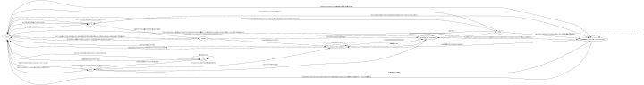

# Romo Considered Harmful
    
---
  
## Abstract

It is self-evident that, given a space of sufficient dimension
such that there exists both a library and fatfucking facilities,
we can prove the existence and presence of cryptid objects living in these facilities,
marked by their shunning of sunlight, and their subsistence off of algebraic texts [1](#bibliography).
  

In this paper, we apply [sophisticated graph transformations](http://www.jflap.org/) to map a representation
of the aforementioned cosmic horror to a universe which not only enables but also rewards the existence of
garbage confluent objects [3](#bibliography).  
  

Exploratory results about the nature of this phenomenon will be presented,
finishing with proposed strategies for its immediate termination.
      
Special thanks to the Graph Transformation Department at the University of York [3](#bibliography)
and the LaTeX Division of the now-defunct Leeds office of Imagination Technologies
for funding and empowering this research,
in return requesting only that no one involved ever return to the city.  
    
---
    
## Background: Category Theory

First, a primer on basic concepts in category theory.
    

    
Now you have a master's in category theory.  

## Definition: JACK

Definition

  
Recall the category **C** of cryptids and their morphisms.
It is immediately clear that no such accommodating universe **U** could possibly entail a god,
so we denote this property of no god **N** for *no god*.
Using the [most sophisticated lexical analysis](http://jackromo.com/2019/Improving-the-GP2-Compiler.pdf) devised,
we apply transformation **T**
(the highest known grade achieved for [any PhD thesis](http://etheses.whiterose.ac.uk/12586/))
to yield  

`CUNT`.  
Employ a little quantum decryption:  
`CUNT mod 69 === JACK`.  
Then the entity known as JACK has been defined.  

    
  
---
  
  
## Theorem: JACK is 24 years old
    
## Proof:
    
We define JACK as a category `Cat(J)`, whose objects are the pages of the many books he reads. 
The functors between them are described as below:    

---

The algebra of the Octonions **O** is a vector space of dimension 8 over **R**.  
Moreover, `8 * 3 = 24`    

Let F be a functor between JACK and **O**.  
**O** is also the fifteenth letter of the alphabet, so we look to JACK's formative years.  

Following a deep dive into his previous social media **|S|**  
( **|S|** being a category containing Club Penguin and a 
reveals JACK was only capable of understanding life through Minecraft constructions.    

We must then construct a finite state automaton to accept the language encoded into his psyche, given below:  
The automaton of scholarly states (or ASS for short):  

 automaton of scholarly states 

  

  
The implications are immediately obvious.
A reduced graph resulting from row echelon reduction has nevertheless been included for the reader's convenience.
  

 Simplified state machine 

  

In fact, this automaton not only accepts JACK's current literary intake but also all future reading he will ever do.
As such, JACK's entire academic career has been encoded into this ASS.  
We have included an [example excerpt here](futuremathspaper.md).    

[Tüuürtle Bæ lemma](https://theworldnews.net/gb-news/what-you-can-buy-for-1p-and-2p-as-the-government-confirms-the-coins-are-here-to-stay)
**TBC** oh god do not let me forget to finish this    
  
  
---

    
## Methodology
We gathered data from the University of York, University of Oxford,
and all local Wetherspoons and McDonalds establishments.
Analysis focused on trneds in local cheese consumption, records of eldritch algebaraic texts disappearing, 
and reports of cringe being observed late into the night.  

Experiments were conducted in various forms of inebriation in order to control for bias.
No animals were harmed in the course of this study, 
though all colleagues involved in peer-review reported receiving 2d4 psychic damage.  
    
    
---

## Bibliography

[1] Mathematics. 2021. Mathematics - Wikipedia. [online] Available at: <https://en.wikipedia.org/wiki/Mathematics> [Accessed 8 April 2021].

[2] Graham Campbell. 1997. [online] Available at: <https://memetrash.co.uk/> [Accessed 13 May 1997].

[3] Detlef Plump. 10BC [online] Available at: <https://www-users.cs.york.ac.uk/det/> [Accessed constantly].

